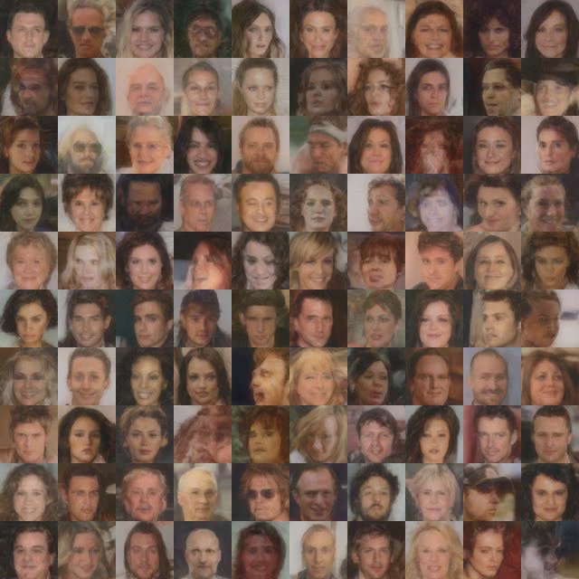

# Latent Diffusion Model (LDM) for Face Generation

This repository implements a **Latent Diffusion Model (LDM)** for generating **64**×**64** face images using the CelebA dataset. By operating in a compressed latent space rather than pixel space, this approach significantly reduces computational requirements while maintaining high-quality synthesis.

## 📊 Results

Below are the results generated by the model using different noise schedules.

|               Cosine Schedule               |               Linear Schedule               |
| :------------------------------------------: | :------------------------------------------: |
|  |  |

🚀 The Pipeline

Training a diffusion model directly on **64**×**64**×**3** pixel space is computationally expensive. Following the principles of  *High-Resolution Image Synthesis with Latent Diffusion Models* , this project uses a two-stage approach:

1. **Stage 1: Neural Image Compression** : Train a Variational Autoencoder (VAE) to map images into a compact, 2D spatial latent space.
2. **Stage 2: Latent Diffusion** : Train a U-Net to model the distribution of these latent encodings.

---

## 🛠 Model Architecture & Training

### 1. Variational Autoencoder (VAE)

* **Parameters** : 2.8M.
* **Compression factor (**f** )** : 4 (Input **64**×**64**×**3** → Latent **16**×**16**×**8**).
* **Loss Function** : A weighted combination of  **MSE** ,  **Perceptual (LPIPS)** , and  **KLD** .
* **KLD Weighting** : A small weight of **1**×**1**0**−**6 was applied to the KL-Divergence term. This prioritizes high-fidelity reconstruction over a strictly standard-normal latent distribution, which is crucial for preserving facial identity.
* **Activation** : Note that **Tanh was not used** at the output layer. The model relies on the loss surface to map the output distribution.

### 2. Latent Processing

To prepare the data for the Diffusion stage:

* **Deterministic Encodings** : The `mean` predicted by the VAE encoder is used as the latent representation.
* **Variance Scaling** : To ensure the Diffusion model receives a unit-variance distribution (**s**t**d**≈**1**), all latents are multiplied by a global scale factor (**1/**global_std). This scale factor is reversed before decoding during inference.

### 3. Diffusion Model (U-Net)

* **Parameters** : 35M.
* **Task** : The model is trained to predict the noise added to the **16**×**16**×**8** latent tensors.
* **Schedules** : Both **Linear** and **Cosine** schedules were implemented.
* **Timesteps** : 1000 steps.

---

## 🔬 Lessons Learned & Implementation Nuances

* **Dynamic Thresholding** : During sampling, it is critical to predict **x**0 at each step and  **clamp it to **[**−**1**,**+**1**]**** . This prevents "mean drift" and ensures the latent distribution remains stable throughout the 1000-step reverse process.
* **Variance Handling** : In early experiments, a "Variance Collapse" was observed where the generated latents had a lower standard deviation (**∼**0.58) than the training data (**∼**0.99), leading to low-contrast results.
* **Sampling Grain** : For Cosine schedules, residual noise can sometimes appear in the final steps. Implementing a "clean finish"—reducing or removing noise injection in the final 5–10 steps—can result in smoother final images.

---

## 📊 Results

| Schedule         | Sample Output                           |
| ---------------- | --------------------------------------- |
| **Cosine** | `results/celeb_ldm2_10x10_cosine.png` |
| **Linear** | `results/celeb_ldm2_10x10_linear.png` |

Export to Sheets

---

## 🏃 Quick Start

### 1. Requirements

* PyTorch
* LPIPS
* TQDM
* CelebA Dataset (Small Images)

### 2. Execution Flow

1. **Train VAE** : `python train_vae.py`
2. **Generate Latents** : `python create_encodings.py` (This saves the `.pt` file containing all pre-computed latents).
3. **Train Diffusion** : `python train_diffusion.py`
4. **Inference** : Run `infer.py` to generate new samples. This script handles the reverse diffusion process, scale-factor adjustment, and VAE decoding.

### 3. Sampling

The `sampling.py` file includes various techniques. While **Ancestral Sampling** was the primary method used, the pipeline is modular; feel free to experiment with DDIM or other ODE-based samplers.

---

## 🤝 Contributing

Feel free to clone the repo and experiment! Areas for further exploration include:

* Reducing VAE latent dimensions further to save more compute.
* Adding a Tanh activation to the VAE output to compare reconstruction stability.
* Implementing Min-SNR weighting during Diffusion training.
